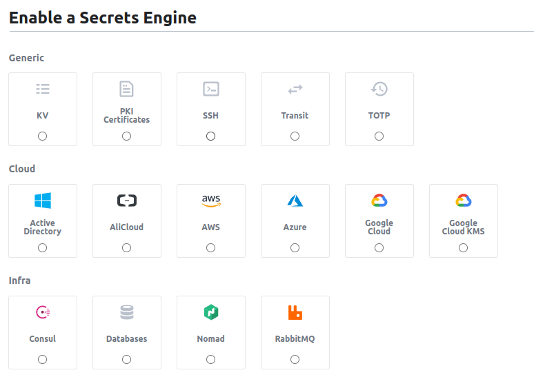
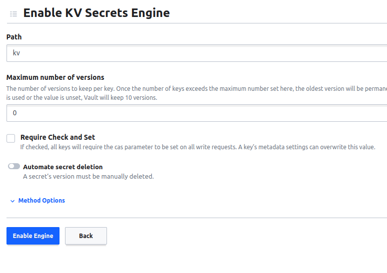
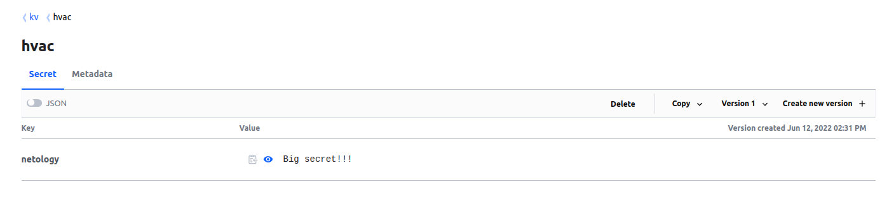

# Домашнее задание к занятию "14.2 Синхронизация секретов с внешними сервисами. Vault"

## Задача 1: Работа с модулем Vault

<details>

  <summary>Описание задачи</summary> 

Запустить модуль Vault конфигураций через утилиту kubectl в установленном minikube

```
kubectl apply -f 14.2/vault-pod.yml
```

Получить значение внутреннего IP пода

```
kubectl get pod 14.2-netology-vault -o json | jq -c '.status.podIPs'
```

Примечание: jq - утилита для работы с JSON в командной строке

Запустить второй модуль для использования в качестве клиента

```
kubectl run -i --tty fedora --image=fedora --restart=Never -- sh
```

Установить дополнительные пакеты

```
dnf -y install pip
pip install hvac
```

Запустить интепретатор Python и выполнить следующий код, предварительно
поменяв IP и токен

```
import hvac
client = hvac.Client(
    url='http://10.10.133.71:8200',
    token='aiphohTaa0eeHei'
)
client.is_authenticated()

# Пишем секрет
client.secrets.kv.v2.create_or_update_secret(
    path='hvac',
    secret=dict(netology='Big secret!!!'),
)

# Читаем секрет
client.secrets.kv.v2.read_secret_version(
    path='hvac',
)
```
</details>
  

### Решение


1. Манифесты для деплоя Vault взял из примера https://gitlab.com/k11s-os/k8s-lessons/-/tree/main/Vault, изменил только storageClassName (./vault/).

2. Для удобства подготовил docker образ с fedora (./app/Dockerfile) с установленными pip и hvac (запушил в https://hub.docker.com/repository/docker/rdegtyarev/fedora-pip).

3. Cоздал манифест для деплоя модифицированной fedora (./task-1/fedora-deployment).

4. Создал неймспейс для приложения

```
kubectl create namespace clokub-14-02
```

5. Деплоим Vault в созданный неймспейс
```
kubectl apply -f ./vault/00-cm.yaml -n clokub-14-02 

kubectl apply -f ./vault/01-ss.yaml -n clokub-14-02 

kubectl apply -f ./vault/02-svc.yaml -n clokub-14-02 
```

6. Делаем порт форвард на созданный сервис, переходим в веб интерфейс vault, конфигурируем через веб интерфейс и сохраняем ключи.

7. Авторизуемся под полученным root токеном

8. Создаем в веб интерфейсе новый Secrets Engine

Выбираем Generic -> kv


Указываем имя, в моем случае "kv". Выше в инструкции пропущено указание mount point, поэтому при создании секрета будут появляться ошибки о несуществующем пути.



9. Получаем ip адрес пода с vault 
```
kubectl get pod -n clokub-14-02 vault-0 -o json | jq -c '.status.podIPs'
[{"ip":"10.112.129.11"}]
```

10. Деплоим модифицированную fedora, переходим в консоль контейнера и запускаем интерпретатор python

```
kubectl apply -f ./task-1/ -n clokub-14-02

kubectl exec -n clokub-14-02 -it fedora-64b5888bd5-p9sbs -- sh

python3
sh-5.1# python3
Python 3.10.4 (main, Mar 25 2022, 00:00:00) [GCC 12.0.1 20220308 (Red Hat 12.0.1-0)] on linux
Type "help", "copyright", "credits" or "license" for more information.
>>> 
```

11. Импортируем hvac и настраиваем клиент с использованием полученного адреса vault и root токена
```
>>> import hvac
>>> client = hvac.Client(
...     url='http://10.112.129.11:8200',
...     token='s.WvCvac6xd88Qohq21MWiD1NO'
... )
>>> client.is_authenticated()
True
>>> 
```

12. Создаем секрет (с указанием mount_point='kv')
```
>>> client.secrets.kv.v2.create_or_update_secret(
...     mount_point='kv',
...     path='hvac/',
...     secret=dict(netology='Big secret!!!'),
... )
{'request_id': '3cc957d2-db75-f2a7-e190-144f9370dd8f', 'lease_id': '', 'renewable': False, 'lease_duration': 0, 'data': {'created_time': '2022-06-12T11:31:10.625103813Z', 'custom_metadata': None, 'deletion_time': '', 'destroyed': False, 'version': 1}, 'wrap_info': None, 'warnings': None, 'auth': None}
>>> 
```
13. Читаем секрет

```
>>> client.secrets.kv.v2.read_secret_version(
...     mount_point='kv',
...     path='hvac',
... )
{'request_id': 'f6f3cbb3-aedb-25bb-1a5f-a786f8094035', 'lease_id': '', 'renewable': False, 'lease_duration': 0, 'data': {'data': {'netology': 'Big secret!!!'}, 'metadata': {'created_time': '2022-06-12T11:31:10.625103813Z', 'custom_metadata': None, 'deletion_time': '', 'destroyed': False, 'version': 1}}, 'wrap_info': None, 'warnings': None, 'auth': None}
>>> 
```

13. Проверяем через веб интерфейс



14. Поды в неймспейсе

```
kubectl get pods -n clokub-14-02 -o wide
NAME                      READY   STATUS    RESTARTS   AGE   IP              NODE                        NOMINATED NODE   READINESS GATES
fedora-64b5888bd5-p9sbs   1/1     Running   0          55m   10.112.128.31   cl10p6oi6aqsnpccnn8e-ohon   <none>           <none>
vault-0                   1/1     Running   1          14h   10.112.129.11   cl10p6oi6aqsnpccnn8e-iquh   <none>           <none>
```
---

## Задача 2 (*): Работа с секретами внутри модуля

<details>

  <summary>Описание задачи</summary> 

* На основе образа fedora создать модуль;
* Создать секрет, в котором будет указан токен;
* Подключить секрет к модулю;
* Запустить модуль и проверить доступность сервиса Vault.

</details>

### Решение

  
1. 


```
kubectl exec -n clokub-14-02 vault-approle-demo-6fb4c6f86b-mtwbt --container fedora -- python3 /app/main.py

```

2. 

3. 


---

