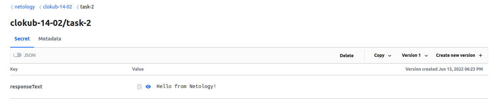

# Домашнее задание к занятию "14.2 Синхронизация секретов с внешними сервисами. Vault"

## Задача 1: Работа с модулем Vault

<details>

  <summary>Описание задачи</summary> 

Запустить модуль Vault конфигураций через утилиту kubectl в установленном minikube

```
kubectl apply -f 14.2/vault-pod.yml
```

Получить значение внутреннего IP пода

```
kubectl get pod 14.2-netology-vault -o json | jq -c '.status.podIPs'
```

Примечание: jq - утилита для работы с JSON в командной строке

Запустить второй модуль для использования в качестве клиента

```
kubectl run -i --tty fedora --image=fedora --restart=Never -- sh
```

Установить дополнительные пакеты

```
dnf -y install pip
pip install hvac
```

Запустить интепретатор Python и выполнить следующий код, предварительно
поменяв IP и токен

```
import hvac
client = hvac.Client(
    url='http://10.10.133.71:8200',
    token='aiphohTaa0eeHei'
)
client.is_authenticated()

# Пишем секрет
client.secrets.kv.v2.create_or_update_secret(
    path='hvac',
    secret=dict(netology='Big secret!!!'),
)

# Читаем секрет
client.secrets.kv.v2.read_secret_version(
    path='hvac',
)
```
</details>
  

### Решение


1. Манифесты для деплоя Vault взял из примера https://gitlab.com/k11s-os/k8s-lessons/-/tree/main/Vault, изменил только storageClassName (./vault/).

2. Для удобства подготовил docker образ с fedora (./app/Dockerfile) с установленными pip и hvac (запушил в https://hub.docker.com/repository/docker/rdegtyarev/fedora-pip, версия 0.1.0).

3. Cоздал манифест для деплоя модифицированной fedora (./task-1/fedora-deployment).

4. Создал неймспейс для приложения

```
kubectl create namespace clokub-14-02
```

5. Деплоим Vault в созданный неймспейс
```
kubectl apply -f ./vault/00-cm.yaml -n clokub-14-02 

kubectl apply -f ./vault/01-ss.yaml -n clokub-14-02 

kubectl apply -f ./vault/02-svc.yaml -n clokub-14-02 
```

6. Делаем порт форвард на созданный сервис, переходим в веб интерфейс vault, конфигурируем через веб интерфейс и сохраняем ключи.

7. Авторизуемся под полученным root токеном

8. Создаем в веб интерфейсе новый Secrets Engine

Выбираем Generic -> kv


Указываем имя, в моем случае "kv". Выше в инструкции пропущено указание mount point, поэтому при создании секрета будут появляться ошибки о несуществующем пути.


9. Получаем ip адрес пода с vault 
```
kubectl get pod -n clokub-14-02 vault-0 -o json | jq -c '.status.podIPs'
[{"ip":"10.112.129.11"}]
```

10. Деплоим модифицированную fedora, переходим в консоль контейнера и запускаем интерпретатор python

```
kubectl apply -f ./task-1/ -n clokub-14-02

kubectl exec -n clokub-14-02 -it fedora-64b5888bd5-p9sbs -- sh

python3
sh-5.1# python3
Python 3.10.4 (main, Mar 25 2022, 00:00:00) [GCC 12.0.1 20220308 (Red Hat 12.0.1-0)] on linux
Type "help", "copyright", "credits" or "license" for more information.
>>> 
```

11. Импортируем hvac и настраиваем клиент с использованием полученного адреса vault и root токена
```
>>> import hvac
>>> client = hvac.Client(
...     url='http://10.112.129.11:8200',
...     token='s.WvCvac6xd88Qohq21MWiD1NO'
... )
>>> client.is_authenticated()
True
>>> 
```

12. Создаем секрет (с указанием mount_point='kv')
```
>>> client.secrets.kv.v2.create_or_update_secret(
...     mount_point='kv',
...     path='hvac/',
...     secret=dict(netology='Big secret!!!'),
... )
{'request_id': '3cc957d2-db75-f2a7-e190-144f9370dd8f', 'lease_id': '', 'renewable': False, 'lease_duration': 0, 'data': {'created_time': '2022-06-12T11:31:10.625103813Z', 'custom_metadata': None, 'deletion_time': '', 'destroyed': False, 'version': 1}, 'wrap_info': None, 'warnings': None, 'auth': None}
>>> 
```
13. Читаем секрет

```
>>> client.secrets.kv.v2.read_secret_version(
...     mount_point='kv',
...     path='hvac',
... )
{'request_id': 'f6f3cbb3-aedb-25bb-1a5f-a786f8094035', 'lease_id': '', 'renewable': False, 'lease_duration': 0, 'data': {'data': {'netology': 'Big secret!!!'}, 'metadata': {'created_time': '2022-06-12T11:31:10.625103813Z', 'custom_metadata': None, 'deletion_time': '', 'destroyed': False, 'version': 1}}, 'wrap_info': None, 'warnings': None, 'auth': None}
>>> 
```

13. Проверяем через веб интерфейс


14. Поды в неймспейсе

```
kubectl get pods -n clokub-14-02 -o wide
NAME                      READY   STATUS    RESTARTS   AGE   IP              NODE                        NOMINATED NODE   READINESS GATES
fedora-64b5888bd5-p9sbs   1/1     Running   0          55m   10.112.128.31   cl10p6oi6aqsnpccnn8e-ohon   <none>           <none>
vault-0                   1/1     Running   1          14h   10.112.129.11   cl10p6oi6aqsnpccnn8e-iquh   <none>           <none>
```
---

## Задача 2 (*): Работа с секретами внутри модуля

<details>

  <summary>Описание задачи</summary> 

* На основе образа fedora создать модуль;
* Создать секрет, в котором будет указан токен;
* Подключить секрет к модулю;
* Запустить модуль и проверить доступность сервиса Vault.

</details>

### Решение

1. Создаем kv секрет в vault (использовал веб интерфейс) /netology/clokub-14-02/task-2

key: responseText
value: Hello from Netology!  



2. Переходим в контейнер vault и заполняем переменные окружения для авторизации в vault

```shell
$ kubectl exec -ti -n clokub-14-02 vault-0  -- sh

$ export VAULT_ADDR=http://127.0.0.1:8200
$ export VAULT_TOKEN=<<you token>>
```


3. Создаем политику для роли


```shell
$ vault policy write -tls-skip-verify clokube-14-02-t2 -<<EOF
# Read-only permission on secrets stored at 'netology/clokub-14-02/task-2'
path "netology/data/clokub-14-02/task-2" {
  capabilities = [ "read" ]
}
EOF

Success! Uploaded policy: clokube-14-02-t2
```

4. Создаем роль

```shell
$ vault write -tls-skip-verify auth/approle/role/my-app-role \
  token_policies="clokube-14-02-t2" \
  token_ttl=1h \
  token_max_ttl=4h \
  secret_id_bound_cidrs="0.0.0.0/0","127.0.0.1/32" \
  token_bound_cidrs="0.0.0.0/0","127.0.0.1/32" \
  secret_id_ttl=60m policies="clokube-14-02-t2" \
  bind_secret_id=false

Success! Data written to: auth/approle/role/my-app-role
```

5. Проверяем созданную роль

```shell
$ vault read -tls-skip-verify auth/approle/role/my-app-role
Key                        Value
---                        -----
bind_secret_id             false
local_secret_ids           false
policies                   [clokube-14-02-t2]
secret_id_bound_cidrs      [0.0.0.0/0 127.0.0.1/32]
secret_id_num_uses         0
secret_id_ttl              1h
token_bound_cidrs          [0.0.0.0/0 127.0.0.1]
token_explicit_max_ttl     0s
token_max_ttl              4h
token_no_default_policy    false
token_num_uses             0
token_period               0s
token_policies             [clokube-14-02-t2]
token_ttl                  1h
token_type                 default
```

6. Получить RoleID

```shell
$ vault read -tls-skip-verify auth/approle/role/my-app-role/role-id
Key        Value
---        -----
role_id    305f6e63-a849-bcd2-41af-b052df35f94d
```


7. Подготовил python скрипт, который читает секрет из vault, использующий approle unwrappen token для авторизации (./app/scripts/main.py)
```python
import hvac
import os

# Получаем путь до файла с токеном из env (APPROLE_UNWRAPPEN_TOKEN_FILE)
token_file = os.getenv('APPROLE_UNWRAPPEN_TOKEN_FILE')
# Читаем файл и записываем в переменную t
t=open(token_file, "r").read()

# Получаем url vault из env (APPROLE_VAULT_ADDR)
u=os.getenv('APPROLE_VAULT_ADDR')

# Получаем mount_point секрета из env (APPROLE_SECRET_MOUNT_POINT)
mp=os.getenv('APPROLE_SECRET_MOUNT_POINT')

# Получаем path секрета из env (APPROLE_SECRET_PATH)
p=os.getenv('APPROLE_SECRET_PATH')

# Авторизуемся в vault с использованием полученного токена
client = hvac.Client(
  url=u,
  token=t
)

# Читаем секрет из vault, из указанного в переменной path и mount_point
result=client.secrets.kv.v2.read_secret_version(
  mount_point=mp,
  path=p
)

# Отдаем ответ
print(result["data"]["data"]["responseText"])
```

8. Сбилдил новую версию образа федора (на основе того что делал для задачи 1), с копированием в образ скрипта python

```Dockerfile
FROM fedora
RUN dnf -y install pip jq && pip install hvac
COPY /scripts /app
```

9. Запушил образ в https://hub.docker.com/repository/docker/rdegtyarev/fedora-pip (версия 0.2.0)

10. Подготовил СonfigMap с конфигурацией vault agent
Агент будет авторизоваться по role_id получать токены и сохранять их в файл. Приложение (python скрипт) будет авторизоваться в vault с использованием полученного токена.

```yaml
---
apiVersion: v1
kind: ConfigMap
metadata:
  name: vault-agent-config
data:
  vault-agent.hcl: |
    pid_file = "/tmp/.pidfile"

    auto_auth {
      mount_path = "auth/approle"
      method "approle" {
        config = {
          role_id_file_path = "/etc/vault/config/app-role-id"
        }
      }

      sink {
          type = "file"
          wrap_ttl = "4m"
          config = {
            path = "/etc/vault/config/approle/wrapped_token"
            mode = 0777
          }
        }

      sink {
        type = "file"
        config = {
          path = "/etc/vault/config/approle/unwrapped_token"
          mode = 0777
          }
        }
    }

    vault {
      address = "http://vault.clokub-14-02:8200"
    }
  app-role-id: |
    305f6e63-a849-bcd2-41af-b052df35f94d
```
  
11. Подготовим deployment для двух контейнеров в одном поде. Контейнер с vault agent будет получать и обновлять токены, контейнер с fedora содержит наше приложение (python скрипт)

```yaml
---
apiVersion: apps/v1
kind: Deployment
metadata:
  name: vault-approle-auth
  labels:
    role: vault-approle-auth
spec:
  replicas: 1
  revisionHistoryLimit: 3
  selector:
    matchLabels:
      role: vault-approle-auth
  template:
    metadata:
      labels:
        role: vault-approle-auth
    spec:
      shareProcessNamespace: true
      containers:
        - image: rdegtyarev/fedora-pip:0.2.0
          imagePullPolicy: Always
          name: fedora-app
          resources:
            limits:
              cpu: 200m
              memory: 256Mi
            requests:
              cpu: 100m
              memory: 128Mi
          env:
            - name: APPROLE_ROLE_ID
              valueFrom:
                configMapKeyRef:
                  name: vault-agent-config
                  key: app-role-id
            - name: APPROLE_WRAPPEN_TOKEN_FILE
              value: /app/config/wrapped_token
            - name: APPROLE_UNWRAPPEN_TOKEN_FILE
              value: /app/config/unwrapped_token
            - name: APPROLE_VAULT_ADDR
              value: http://vault.clokub-14-02:8200
            - name: APPROLE_SECRET_MOUNT_POINT
              value: netology
            - name: APPROLE_SECRET_PATH
              value: clokub-14-02/task-2
          command: ["/bin/sleep", "365d"]
          volumeMounts:
            - mountPath: /app/config
              name: approle-config
        - name: vault-agent
          image: vault:1.9.0
          imagePullPolicy: IfNotPresent
          resources:
            limits:
              cpu: 200m
              memory: 256Mi
            requests:
              cpu: 100m
              memory: 128Mi
          securityContext:
            runAsUser: 10001
            runAsNonRoot: true
            capabilities:
              add:
                - IPC_LOCK
          args:
            - "agent"
            - "-config=/etc/vault/config/vault-agent.hcl"
          env:
            - name: SKIP_SETCAP
              value: 'true'
          volumeMounts:
            - mountPath: /etc/vault/config
              name: vault-config
            - mountPath: /etc/vault/config/approle
              name: approle-config
      volumes:
        - name: vault-config
          configMap:
            name: vault-agent-config
        - name: approle-config
          emptyDir:
            medium: Memory

```

12. Применяем манифесты

```shell
$ kubectl apply -f ./00-cm.yaml -n clokub-14-02 
configmap/vault-agent-config created

kubectl apply -f ./01-dp.yaml -n clokub-14-02 
deployment.apps/vault-approle-auth created

```
  
13. Загружаемся в контейнер и проверяем приложение:

```shell
$ kubectl exec -ti -n clokub-14-02 vault-approle-auth-778d467b76-r7s2f --container fedora-app -- sh
$ python3 /app/main.py
Hello from Netology!
```
Приложение успешно авторизуется с использованием полученного токена и возвращает секрет.


Токен обновляется 1 раз в час
```shell
$ cat $APPROLE_UNWRAPPEN_TOKEN_FILE 
s.qHNvnTTwNOXwkJUbJyoFiu1b
```
спустя час

```shell
$ cat $APPROLE_UNWRAPPEN_TOKEN_FILE 

```

---

